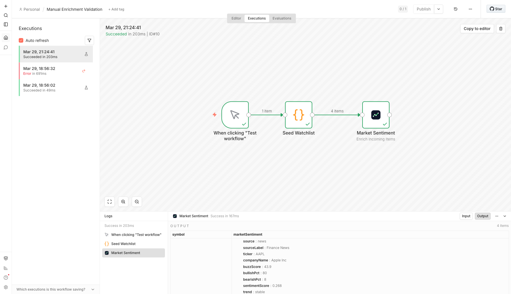

# n8n Market Sentiment Node

`n8n-nodes-market-sentiment` brings structured stock sentiment data from Adanos into n8n workflows.

It is built for finance automations that need usable outputs instead of raw posts:

- enrich a watchlist from Google Sheets, Airtable, or Notion
- send Slack or Discord alerts when a ticker gets unusually hot
- build daily market recap and newsletter workflows
- compare names like `NVDA`, `AMD`, `TSLA`, or `PLTR` before the open

## What it looks like in n8n

Real editor run with the `Enrich Incoming Items` operation on a live watchlist:



## What the node does

The package exposes a single `Market Sentiment` node with three operations:

| Operation | Best for | Output |
| --- | --- | --- |
| `Get Stock Snapshot` | multi-ticker scans | combined or per-source sentiment snapshots |
| `Get Trending Stocks` | source-specific movers | one item per trending ticker |
| `Enrich Incoming Items` | watchlists and downstream routing | original items plus nested sentiment data |

Supported sources:

- `reddit`
- `x`
- `news`
- `polymarket`

## Install in n8n

1. Open `Settings -> Community Nodes`.
2. Install `n8n-nodes-market-sentiment`.
3. Create an `Adanos API` credential.
4. Add the `Market Sentiment` node to your workflow.

Get an API key:

- [https://adanos.org/reddit-stock-sentiment#api-form](https://adanos.org/reddit-stock-sentiment#api-form)

## Credential

The node uses a single credential:

- `API Key`

The node always talks to the official Adanos API at `https://api.adanos.org`.

## Operation guide

### 1. Get Stock Snapshot

Use this for pre-market scans, manual comparisons, and one-shot ticker lookups.

Inputs:

- `tickers`: comma-separated list like `AAPL,NVDA,TSLA`
- `sources`: any mix of `reddit`, `x`, `news`, `polymarket`
- `days`: lookback window, `1` to `90`
- `outputMode`
  - `combined`: one row per ticker with averaged metrics and source alignment
  - `perSource`: one row per ticker/source pair
  - `raw`: raw source payloads grouped into one result item

### 2. Get Trending Stocks

Use this for “what is moving right now?” workflows.

Inputs:

- `source`: `reddit`, `x`, `news`, or `polymarket`
- `days`: lookback window, `1` to `90`
- `limit`: `1` to `100`
- `offset`
- `assetType`: `all`, `stock`, or `etf`

### 3. Enrich Incoming Items

Use this when you already have items coming from Sheets, Airtable, Notion, webhooks, or a Code node.

Inputs:

- `tickerField`: input field that holds the stock ticker
- `targetField`: field that will receive the combined snapshot
- `sources`
- `days`
- `includeSources`: include nested per-source breakdowns or not

Typical flow:

`Google Sheets -> Market Sentiment -> IF / Slack / AI summarizer`

## Output shape

Combined snapshot example:

```json
{
  "ticker": "AAPL",
  "companyName": "Apple Inc",
  "averageBuzz": 36.73,
  "averageBullishPct": 63.5,
  "averageBearishPct": 15,
  "averageSentimentScore": 0.16,
  "coverage": 3,
  "sourceAlignment": "divergent",
  "sources": {
    "news": {
      "sourceLabel": "Finance News",
      "buzzScore": 43.9,
      "bullishPct": 80,
      "activity": 25,
      "activityLabel": "mentions",
      "trend": "stable"
    },
    "x": {
      "sourceLabel": "X.com",
      "buzzScore": 66.3,
      "bullishPct": 47,
      "activity": 287,
      "activityLabel": "mentions",
      "trend": "falling"
    }
  }
}
```

Enriched item example:

```json
{
  "symbol": "NVDA",
  "marketSentiment": {
    "averageBuzz": 38.8,
    "averageBullishPct": 59.5,
    "coverage": 3,
    "sourceAlignment": "mixed"
  }
}
```

## Import-ready example workflows

These are the fastest way to smoke-test the node inside a real n8n instance:

- [Manual snapshot validation](./examples/manual-snapshot-validation.workflow.json)
- [Manual enrichment validation](./examples/manual-enrichment-validation.workflow.json)

More workflow templates:

- [Daily market recap](./examples/daily-market-recap.workflow.json)
- [Watchlist enrichment](./examples/watchlist-enrichment.workflow.json)
- [Trending alert](./examples/trending-alert.workflow.json)

After import, select your `Adanos API` credential on the `Market Sentiment` node and run the workflow.

## Local runtime validation

This package was validated inside a real Docker n8n instance on `2026-03-29`.

Validated paths:

- node installs as a community node
- credential loads in the running n8n server
- `Manual Snapshot Validation` runs in the editor
- `Manual Enrichment Validation` returns `4` enriched watchlist items in the editor output

Practical note:

- editor/manual execution in the running n8n server works
- standalone `n8n execute --id ...` can hit a credential/license-state path in some local environments, so use the editor flow for smoke tests

## Local development

```bash
cd integrations/n8n/market-sentiment-node
npm install
npm run test
npm run typecheck
npm run build
```

Release and submission notes live in [docs/RELEASE_CHECKLIST.md](./docs/RELEASE_CHECKLIST.md).

## Maintainer release flow

This repo publishes from Git tags through [`.github/workflows/publish.yml`](./.github/workflows/publish.yml).

Release steps:

1. bump `package.json` to the target version
2. push `main`
3. create and push the matching tag, for example `v0.1.0`
4. let GitHub Actions run `npm publish --provenance --access public`

The publish workflow fails if the pushed tag does not match `package.json` exactly.
